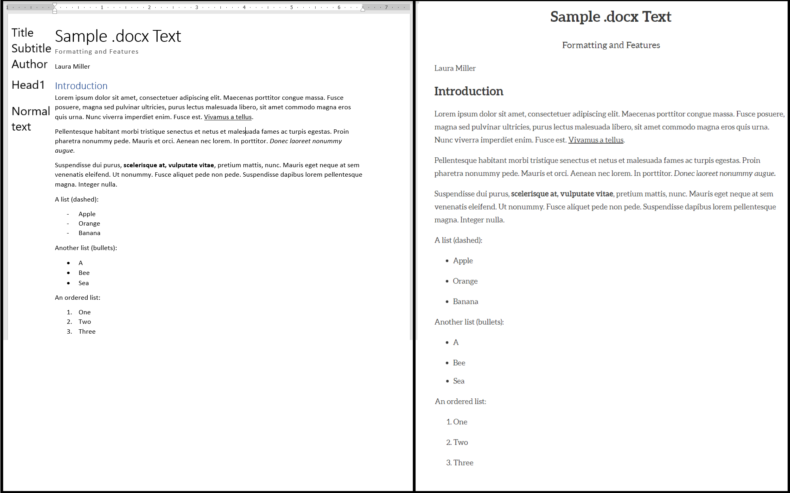
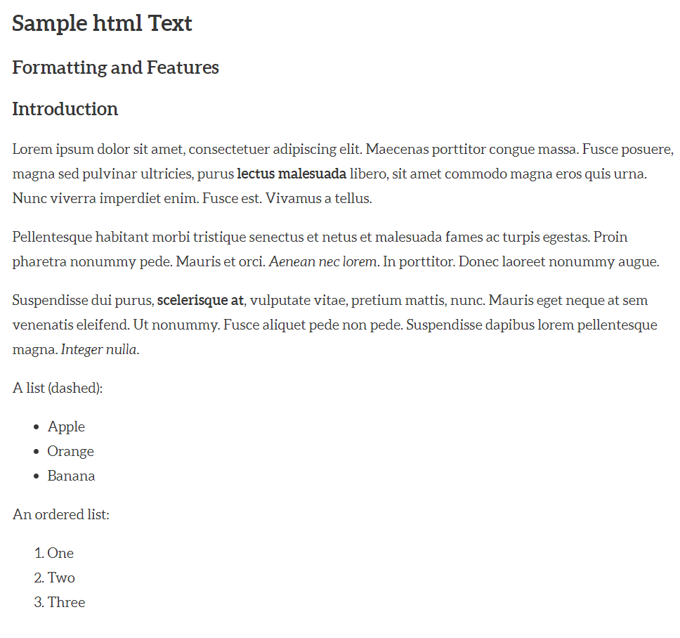
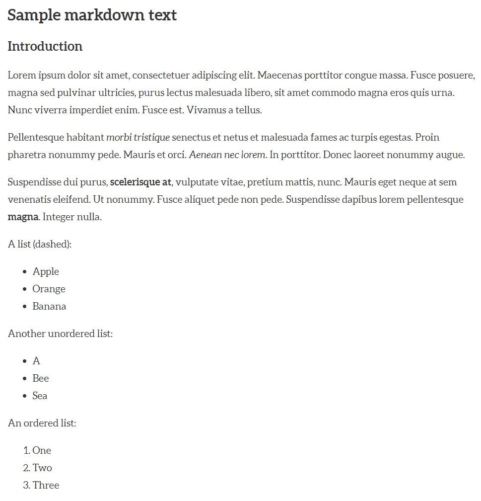

# Preparing Files for Manifold
Manifold accepts a variety of file formats. This guide maps the source formatting to how the document is displyed in Manifold. 

Jump to section:
Basic text formatting: Word  |  HTML  |  Markdown

Images: Word  |  HTML  |  Markdown

Tables: Word  |  HTML  |  Markdown

Advanced text formatting: Word  |  HTML  |  Markdown

## Basic text formatting
### Word documents
Manifold recognizes the text styles built into Word, including Title, Subtitle, Headings, and certain 
formatted fields like Author and Publication Date. Bold and italic texts will be recognized, but fonts and font styles are ignored in favor of Manifold's built-in options. Underlined text should be avoided for its visual similarity to hyperlinks.



### HTML files
Sample code:
    <!DOCTYPE html>

    <html>
    <head>
	    <title>A Sample html Text</title>
    </head>
    <body>
    <h1>Sample html Text</h1>
    <h2>Formatting and Features</h2>
    <h2>Introduction</h2>
    <p>Lorem ipsum dolor sit amet, consectetuer adipiscing elit. Maecenas porttitor congue massa. Fusce posuere, magna sed pulvinar ultricies, purus <strong>lectus malesuada</strong> libero, sit amet commodo magna eros quis urna. Nunc viverra imperdiet enim. Fusce est. Vivamus a tellus.</p>
    <p>Pellentesque habitant morbi tristique senectus et netus et malesuada fames ac turpis egestas. Proin pharetra nonummy pede. Mauris et orci. <em>Aenean nec lorem</em>. In porttitor. Donec laoreet nonummy augue.</p>
    <p>Suspendisse dui purus, <b>scelerisque at</b>, vulputate vitae, pretium mattis, nunc. Mauris eget neque at sem venenatis eleifend. Ut nonummy. Fusce aliquet pede non pede. Suspendisse dapibus lorem pellentesque magna. <i>Integer nulla</i>.</p>
    <p>A list (dashed):
    <ul>
    	<li>Apple</li>
    	<li>Orange</li>
    	<li>Banana</li>
    </ul>
    </p>
    <p>
    An ordered list:
    <ol>
    	<li>One</li>
	 <li>Two</li>
	 <li>Three</li>
    </ol>
    </p>
    </body>
    </html>

The code above renders like this in Manifold:


### Markdown files
Sample code:
```
---
title: A Markdown Sample Chapter
---
# Sample markdown text
## Introduction

Lorem ipsum dolor sit amet, consectetuer adipiscing elit. Maecenas porttitor congue massa. Fusce posuere, magna sed pulvinar ultricies, purus lectus malesuada libero, sit amet commodo magna eros quis urna. Nunc viverra imperdiet enim. Fusce est. Vivamus a tellus.

Pellentesque habitant _morbi tristique_ senectus et netus et malesuada fames ac turpis egestas. Proin pharetra nonummy pede. Mauris et orci. *Aenean nec lorem*. In porttitor. Donec laoreet nonummy augue.

Suspendisse dui purus, __scelerisque at__, vulputate vitae, pretium mattis, nunc. Mauris eget neque at sem venenatis eleifend. Ut nonummy. Fusce aliquet pede non pede. Suspendisse dapibus lorem pellentesque **magna**. Integer nulla.

A list (dashed):

-	Apple
-	Orange
-	Banana

Another unordered list:

* A
* Bee
* Sea

An ordered list:

1.	One
2.	Two
3.	Three
```

