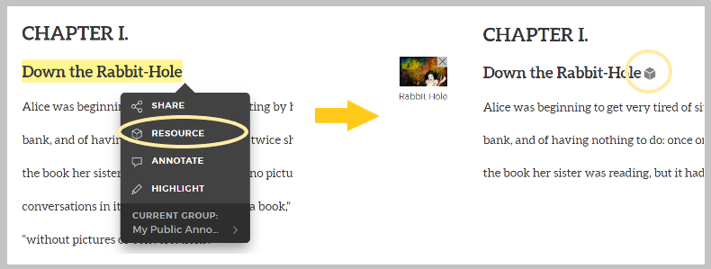
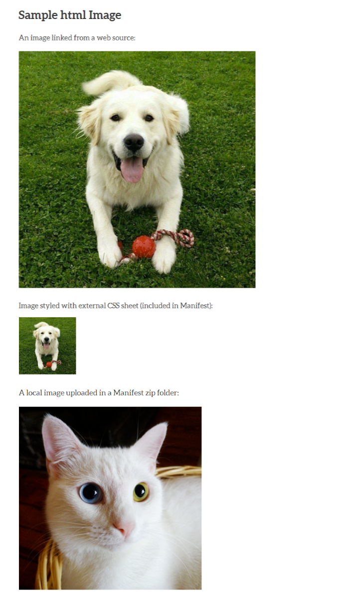
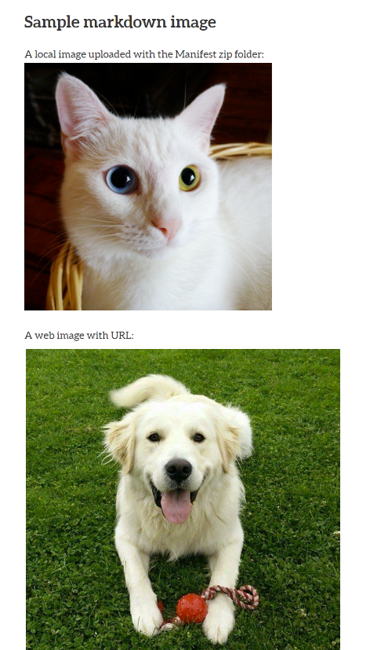
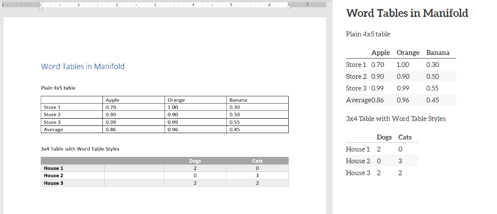
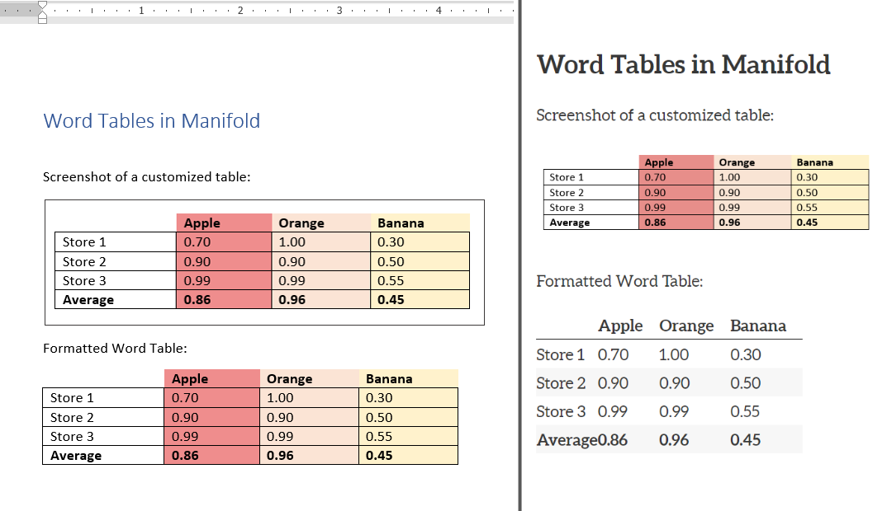

# Preparing Files for Manifold
Manifold accepts a variety of file formats. This guide maps the source formatting to how the document is displyed in Manifold. 

Jump to section:
Basic text formatting: Word  |  HTML  |  Markdown

Images: Word  |  HTML  |  Markdown

Tables: Word  |  HTML  |  Markdown

Advanced text formatting: Word  |  HTML  |  Markdown

## Basic text formatting
### Word documents
Manifold recognizes the text styles built into Word, including Title, Subtitle, Headings, and certain 
formatted fields like Author and Publication Date. Bold and italic texts will be recognized, but fonts and font styles are ignored in favor of Manifold's built-in options. Underlined text should be avoided for its visual similarity to hyperlinks.


### HTML files
Sample code:
    <!DOCTYPE html>

    <html>
    <head>
	    <title>A Sample html Text</title>
    </head>
    <body>
    <h1>Sample html Text</h1>
    <h2>Formatting and Features</h2>
    <h2>Introduction</h2>
    <p>Lorem ipsum dolor sit amet, consectetuer adipiscing elit. Maecenas porttitor congue massa. Fusce posuere, magna sed pulvinar ultricies, purus <strong>lectus malesuada</strong> libero, sit amet commodo magna eros quis urna. Nunc viverra imperdiet enim. Fusce est. Vivamus a tellus.</p>
    <p>Pellentesque habitant morbi tristique senectus et netus et malesuada fames ac turpis egestas. Proin pharetra nonummy pede. Mauris et orci. <em>Aenean nec lorem</em>. In porttitor. Donec laoreet nonummy augue.</p>
    <p>Suspendisse dui purus, <b>scelerisque at</b>, vulputate vitae, pretium mattis, nunc. Mauris eget neque at sem venenatis eleifend. Ut nonummy. Fusce aliquet pede non pede. Suspendisse dapibus lorem pellentesque magna. <i>Integer nulla</i>.</p>
    <p>A list (dashed):
    <ul>
    	<li>Apple</li>
    	<li>Orange</li>
    	<li>Banana</li>
    </ul>
    </p>
    <p>
    An ordered list:
    <ol>
    	<li>One</li>
	 <li>Two</li>
	 <li>Three</li>
    </ol>
    </p>
    </body>
    </html>

The code above renders like this in Manifold:


### Markdown files
Sample code:
```
---
title: A Markdown Sample Chapter
---
# Sample markdown text
## Introduction

Lorem ipsum dolor sit amet, consectetuer adipiscing elit. Maecenas porttitor congue massa. Fusce posuere, magna sed pulvinar ultricies, purus lectus malesuada libero, sit amet commodo magna eros quis urna. Nunc viverra imperdiet enim. Fusce est. Vivamus a tellus.

Pellentesque habitant _morbi tristique_ senectus et netus et malesuada fames ac turpis egestas. Proin pharetra nonummy pede. Mauris et orci. *Aenean nec lorem*. In porttitor. Donec laoreet nonummy augue.

Suspendisse dui purus, __scelerisque at__, vulputate vitae, pretium mattis, nunc. Mauris eget neque at sem venenatis eleifend. Ut nonummy. Fusce aliquet pede non pede. Suspendisse dapibus lorem pellentesque **magna**. Integer nulla.

A list (dashed):

-	Apple
-	Orange
-	Banana

Another unordered list:

* A
* Bee
* Sea

An ordered list:

1.	One
2.	Two
3.	Three
```
The markdown code is rendered like this in Manifold:


## Embedded Images
Images can be added to Manifold as Resources or embedded directly in the text document. For documents with few or only decorative images, embedding images is fine. For projects with an emphasis on image resources, uploading these files in the Resource section is more appropriate so detailed metadata and permissions can be included. Always include alt-text in your image embeds to ensure the image information is conveyed to screen readers.

Images uploaded as Resources can be linked in the Manifold text by entering the admin preview, highlighting the location where you would like to link an image, and selecting a resource from the pop-up panel.



### Word
Manifold ignores most image styling in Word documents. Images aligned to the center of the page will be automatically displayed left-aligned, and auto-generate Image Captions will not retain their number or caption styling. Image size is ralative to the image size in the Word document.
img


### HTML
Manifold handles HTML images similar to most web pages. Images can be linked from a web location or sourced from a file uploaded in the Manifest. Manifold ignores inline styling, so image sizing must designated in a separate CSS file and assigned a class in the HTML. Resizing images with percentages rather than pixel values may scale better on mobile device screens.

Code sample:
```
<!DOCTYPE html>

<html>
<head>
	<title>A Sample html image</title>
	<link rel="stylesheet" href="imgstyling.css">
</head>
<body>
<h1>Sample html Image</h1>
<p>An image linked from a web source:</p>

<p>Image styled with external CSS sheet (included in Manifest):</p>

<p>A local image uploaded in a Manifest zip folder:</p>

</body>
</html>
```
CSS to reduce image size:
```
.dog {
	height: 150px; 
	width: auto
	}
```
If you need to edit the CSS file after upload, go to the Text page, select Styles from the left-hand menu, and click the pencil icon next to your CSS to edit.




### Markdown
Markdown images can be embedded from the web or included in the Manifest upload. If additional image styling/sizing is needed, you can include HTML syntax withing your Markdown and include a CSS file to specify image classes (see HTML section above).

Code sample:
```
# Sample markdown image
A local image uploaded with the Manifest zip folder:


A web image with URL:

```



## Tables
Before embedding a table in your Manifold text, consider the necesstity of the table format to convey the information. Tables are hard for screen readers to parse and large tables can sometimes be summarized in paragraph form. Simple tables like terms and definitions can written out in single, consecutive lines, and data visualizations with alternative text may be better suited to conveying table information. Due to limitations in Manifold, screenshots with alt text describing the data are a better option for larger tables.

### Word
Tables embedded in Word files lose much of their formatting in Manifold. In the example below, note how Manifold auto-aligns all text to the left and condenses column widths. To add padding between columns, you can add an empty column of any width. Manifold automatically bolds column headers and applies alternating grey shading to rows. To preserve Word Table Styling, insert of screenshot of the table into your Word document instead of the formatted table (second example below).




### HTML

### Markdown
