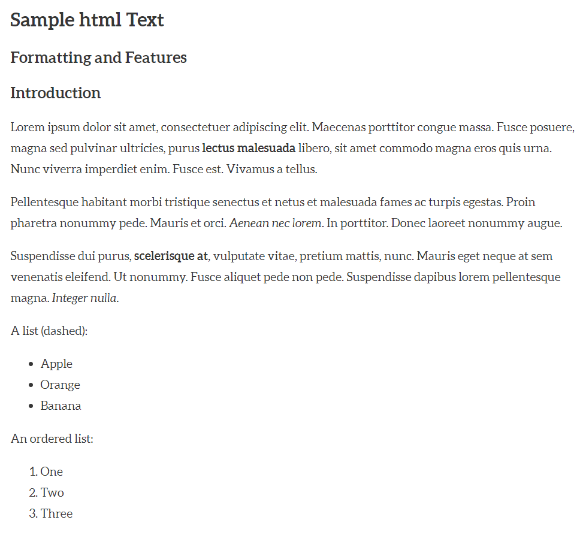
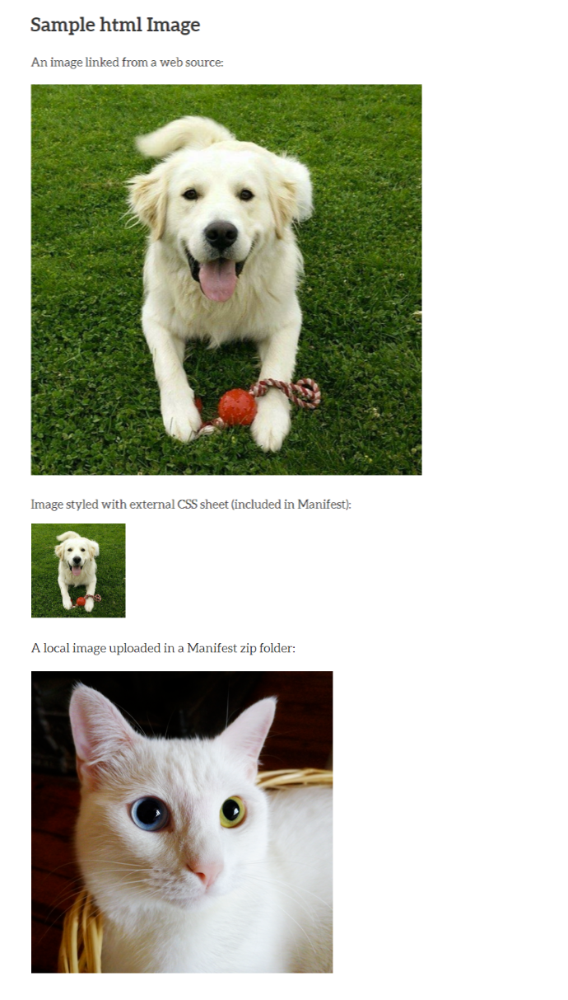

# HTML files
## Basic text formatting

Sample html document:
    <!DOCTYPE html>

    <html>
    <head>
        <title>A Sample html Text</title>
    </head>
    <body>
    <h1>Sample html Text</h1>
    <h2>Formatting and Features</h2>
    <h3>Introduction</h3>
    <p>Lorem ipsum dolor sit amet, consectetuer adipiscing elit. Maecenas porttitor congue massa. Fusce posuere, magna sed pulvinar ultricies, purus <strong>lectus malesuada</strong> libero, sit amet commodo magna eros quis urna. Nunc viverra imperdiet enim. Fusce est. Vivamus a tellus.</p>
    <p>Pellentesque habitant morbi tristique senectus et netus et malesuada fames ac turpis egestas. Proin pharetra nonummy pede. Mauris et orci. <em>Aenean nec lorem</em>. In porttitor. Donec laoreet nonummy augue.</p>
    <p>Suspendisse dui purus, <b>scelerisque at</b>, vulputate vitae, pretium mattis, nunc. Mauris eget neque at sem venenatis eleifend. Ut nonummy. Fusce aliquet pede non pede. Suspendisse dapibus lorem pellentesque magna. <i>Integer nulla</i>.</p>
    <p>Unordered list:
    <ul>
    	<li>Apple</li>
    	<li>Orange</li>
    	<li>Banana</li>
    </ul>
    </p>
    <p>
    An ordered list:
    <ol>
    	<li>One</li>
     <li>Two</li>
     <li>Three</li>
    </ol>
    </p>
    </body>
    </html>

The code above renders like this in Manifold:



## Images

Manifold handles HTML images similar to most web pages. Images can be linked from a web location or sourced from a file uploaded in the manifest .zip folder. Manifold ignores inline styling, so image sizing must designated in a separate CSS file and included in the manifest .zip folder. Resizing images with percentages rather than pixel values may scale better on mobile device screens.

Code sample:

```
<!DOCTYPE html>

<html>
<head>
	<title>A Sample html image</title>
	<link rel="stylesheet" href="imgstyling.css">
</head>
<body>
<h1>Sample html Image</h1>
<p>An image linked from a web source:</p>

<p>Image styled with external CSS sheet (included in Manifest):</p>

<p>A local image uploaded in a Manifest zip folder:</p>

</body>
</html>
```

CSS to reduce image size:

```
.dog {
	height: 150px; 
	width: auto
	}
```

If you need to edit the CSS file after upload, go to the Text page, select Styles from the left-hand menu, and click the pencil icon next to your CSS to edit.


