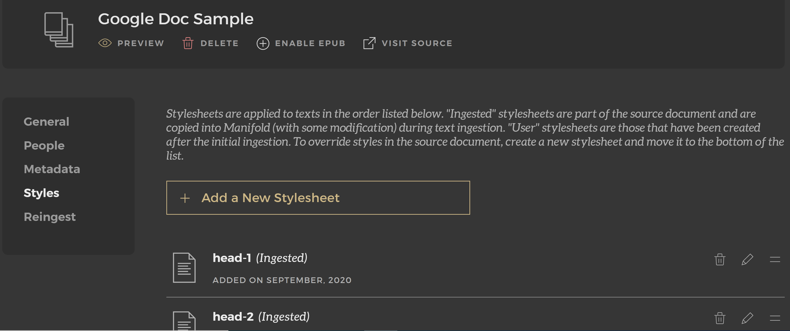
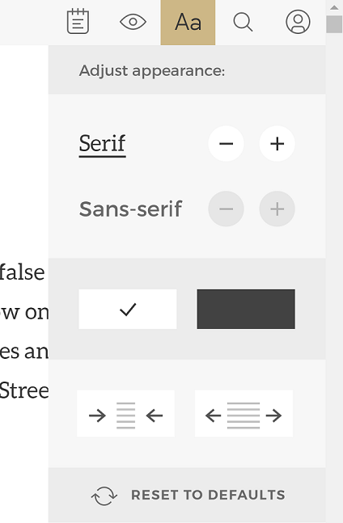

# Manifold Guide for Authors
Manifold accepts a variety of file formats. This guide maps the source formatting in Word, HTML, Google Docs, and Markdown files to how the document is displyed in Manifold. Because there is not a WYSIWYG editor in Manifold, files must be re-uploaded when changes are made. Considering format as manuscripts are drafted can save time during the upload stage. A live preview of the different sample file uploads is available at [link].

Complete documentation for Manifold file formatting and upload is available at [https://manifoldapp.org/docs/projects/preparing/index](https://manifoldapp.org/docs/projects/preparing/index)

## A note on styling/formatting
Manifold has built in default styles for different content types like text, hyperlinks, headings, annd more. Authors can modify these CSS settings for each text within their project to change font settings, image styling, and other visual characteristics of the text. Readers can also adjust the appearance of texts in the user menu to control the margins, font, and background color to suit their preferences. 

To upload a CSS file, select the text from the list in the text menu on the project homepage. On the text homepage, select Styles to upload or edit stylesheets for that text. For projects with multiple texts, the CSS must be added to each text record.

## Resources vs. embedded media
Content like images, videos, files, and links can be added to Manifold as Resources or embedded directly in the text document. Resources can have associated metadata to describe the file, creator, source, and copyright status. For documents with few or only decorative images, embedding images is fine, but projects with an emphasis on multimedia resources may wish to upload these files in the Resource section so detailed metadata and permissions can be included. Always include alt-text in your image embeds to ensure the image information is conveyed to screen readers.

Resources can be linked in the Manifold text by entering the preview, highlighting the location where you would like to link an image, and selecting a resource from the pop-up panel.

<img src="img/imgResource.png" alt="The left side shows highlighted text to insert a resource, and the right side of the graphic shows the resources box icon embedded in the text" max-width="640px" height="auto")

## Accessibility

### Images
In order for graphics, images, and other visuals to be readable by screen readers, alternative text should be added to all figures. Alternative text, or alt text, is descriptive language that conveys the relevant information from an image to visually impaired readers.

[Guide to alt text in Word](https://support.microsoft.com/en-us/office/add-alternative-text-to-a-shape-picture-chart-smartart-graphic-or-other-object-44989b2a-903c-4d9a-b742-6a75b451c669)

[Guide to HTML alt text](https://moz.com/learn/seo/alt-text)

In Markdown, add alt text in quotes following the image path. See this [example](https://www.markdownguide.org/basic-syntax/#images-1).

### Tables
Before embedding a table in your Manifold text, consider the necesstity of the table format to convey the information. Tables are hard for screen readers to parse and large tables can sometimes be summarized in paragraph form. Simple tables like terms and definitions can written out in single, consecutive lines, and data visualizations with alternative text may be better suited to conveying table information. Due to limitations in Manifold, screenshots with alt text describing the data are a better option for larger tables.

## Single file upload vs. multiple file upload
Some projects may only require one file to create a text, but multi-chapter texts should be uploaded with each chapter in a separate file. These separate chapters must then be compressed into a ZIP file along with a YAML metadata file. Any embedded photos, media files, or external CSS files in HTML or Markdown documents should also be zipped into this folder prior to upload. This multi-file upload is called the "Manifest" ingest method. Complete details are available at [https://manifoldapp.org/docs/projects/preparing/index.html#manifest](https://manifoldapp.org/docs/projects/preparing/index.html#manifest).

