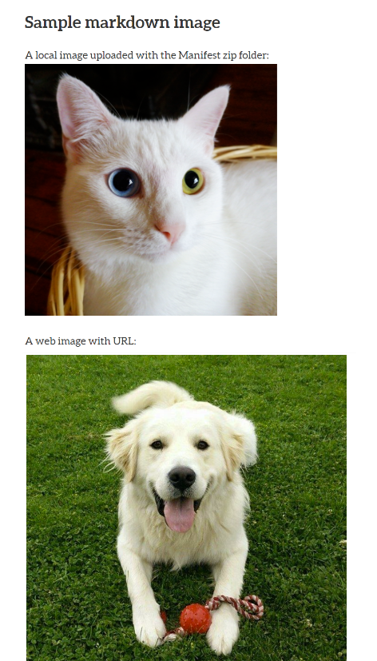

# Markdown 
## Basic text formatting

Sample Markdown code:

```
---
title: A Markdown Sample Chapter
---
# Sample markdown text
## Introduction

Lorem ipsum dolor sit amet, consectetuer adipiscing elit. Maecenas porttitor congue massa. Fusce posuere, magna sed pulvinar ultricies, purus lectus malesuada libero, sit amet commodo magna eros quis urna. Nunc viverra imperdiet enim. Fusce est. Vivamus a tellus.

Pellentesque habitant _morbi tristique_ senectus et netus et malesuada fames ac turpis egestas. Proin pharetra nonummy pede. Mauris et orci. *Aenean nec lorem*. In porttitor. Donec laoreet nonummy augue.

Suspendisse dui purus, __scelerisque at__, vulputate vitae, pretium mattis, nunc. Mauris eget neque at sem venenatis eleifend. Ut nonummy. Fusce aliquet pede non pede. Suspendisse dapibus lorem pellentesque **magna**. Integer nulla.

A list (dashed):

-	Apple
-	Orange
-	Banana

Another unordered list:

* A
* Bee
* Sea

An ordered list:

1.	One
2.	Two
3.	Three
```

The Markdown code is rendered like this in Manifold:


## Images

Markdown images can be embedded from the web or included in the manifest .zip folder upload. If additional image styling/sizing is needed, you can include HTML syntax within your Markdown and include a CSS file to specify image classes.

Code sample:

```
# Sample markdown image
A local image uploaded with the Manifest zip folder:


A web image with URL:

```



## Tables

The [Markdown Table Generator](https://www.tablesgenerator.com/markdown_tables) can help you easily format tables in Markdown.
