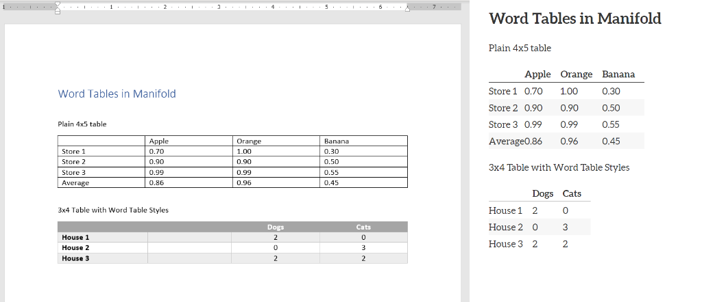
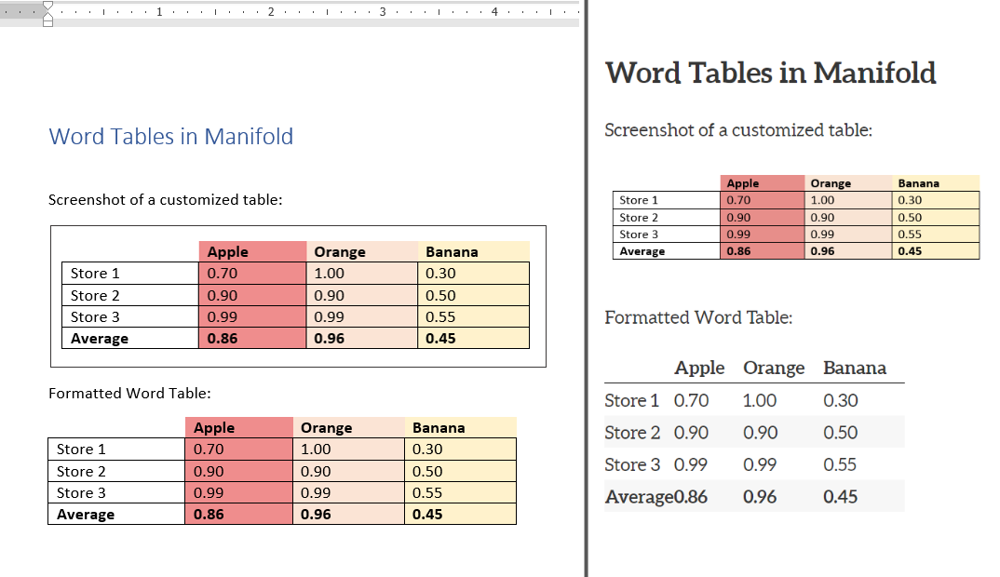

# Word Documents
## Basic text formatting

Manifold recognizes the text styles built into Word, including Title, Subtitle, Headings, and certain formatted fields like Author and Publication Date. Bold and italic texts will be recognized, but fonts and font styles are ignored in favor of Manifold's user-defined reading options options. Underlined text should be avoided for its visual similarity to hyperlinks.

## Images

Manifold will upload images placed in Word files, but it ignores some image styling options. Images aligned to the center of the page in Word will be automatically displayed left-aligned after ingest, and auto-generated Image Captions will not retain their number or caption styling. Image size is ralative to the image size in the Word document.

## Tables

Before embedding a table in your Manifold text, consider the necesstity of the table format to convey the information. Tables are hard for screen readers to parse and large tables can sometimes be summarized in paragraph form. Simple tables like terms and definitions can written out in single, consecutive lines, and data visualizations with alternative text may be better suited to conveying table information. Due to limitations in Manifold, screenshots of tables with alt text describing the data are a better option for larger tables.

Tables embedded in Word files lose much of their formatting in Manifold. In the example below, note how Manifold auto-aligns all text to the left and condenses column widths. To add padding between columns, you can add an empty column of any width to your table. Manifold automatically bolds column headers and applies alternating grey shading to rows. To preserve Word table Styling, take a screenshot of the formatted table and insert the image in place of the data within your document (second example below).

